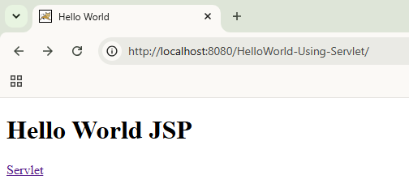
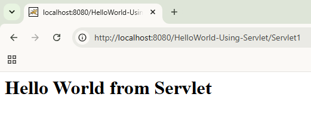

# 👋 Hello World using Servlet


A simple Java web application demonstrating the fundamentals of **Java Servlets** and **JSP**. This project illustrates the basic request-response lifecycle by mapping a URL to a servlet that generates dynamic content and forwards the response to the browser.

---

## ✨ Features

- Servlet mapped using `@WebServlet`
- Handles HTTP requests from the browser
- JSP page as the application entry point
- Dynamic "Hello World" response generated by the server
- Demonstrates the basic servlet request-response lifecycle

---

## 🛠️ Tech Stack

| Category | Technology |
|----------|------------|
| Language | Java 8 |
| Backend | Java Servlet 4.0 |
| View Technology | JSP |
| Web Server | Apache Tomcat 11 |
| IDE | Eclipse / Spring Tool Suite (STS) |

---

## 📁 Project Structure

```text
HelloWorld-Using-Servlet/
├── src/
│   └── main/
│       ├── java/
│       │   └── Servlet1.java
│       └── webapp/
│           ├── helloJSP.jsp
│           └── WEB-INF/
├── pom.xml
└── README.md
```

---

## 🔄 Request Flow

```text
Browser
   │
   ▼
helloJSP.jsp
   │
   ▼
Servlet1 (@WebServlet)
   │
   ▼
HTTP Response
   │
   ▼
Browser
```

---

## 🧠 Concepts Demonstrated

- Java Servlet fundamentals
- URL mapping using `@WebServlet`
- HTTP request and response handling
- JSP as the presentation layer
- Servlet lifecycle basics
- Deploying a Java web application on Apache Tomcat

---

## ⚙️ Getting Started

### Prerequisites

- Java 8
- Apache Tomcat 11
- Eclipse or Spring Tool Suite (STS)

### Clone the Repository

```bash
git clone https://github.com/Atharva-Shelke/HelloWorld-Using-Servlet.git
```

### Run the Application

1. Import the project into Eclipse or STS.
2. Right-click the project.
3. Select **Run As → Run on Server**.
4. Choose your Apache Tomcat 11 server.
5. Open:

```text
http://localhost:8080/HelloWorld-Using-Servlet/
```

---

## 📸 Screenshots

### Home Page



### Hello World Response



---

## 📚 What I Learned

- Java Servlet architecture
- Request-response lifecycle
- URL mapping with annotations
- JSP and Servlet integration
- Deploying web applications on Apache Tomcat
